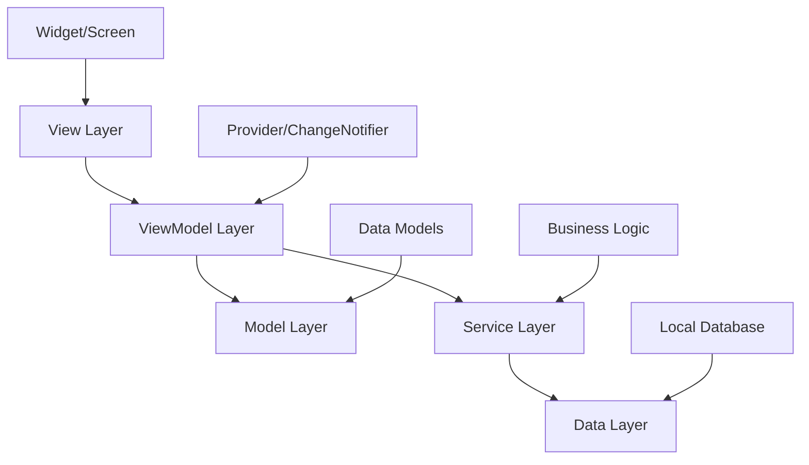
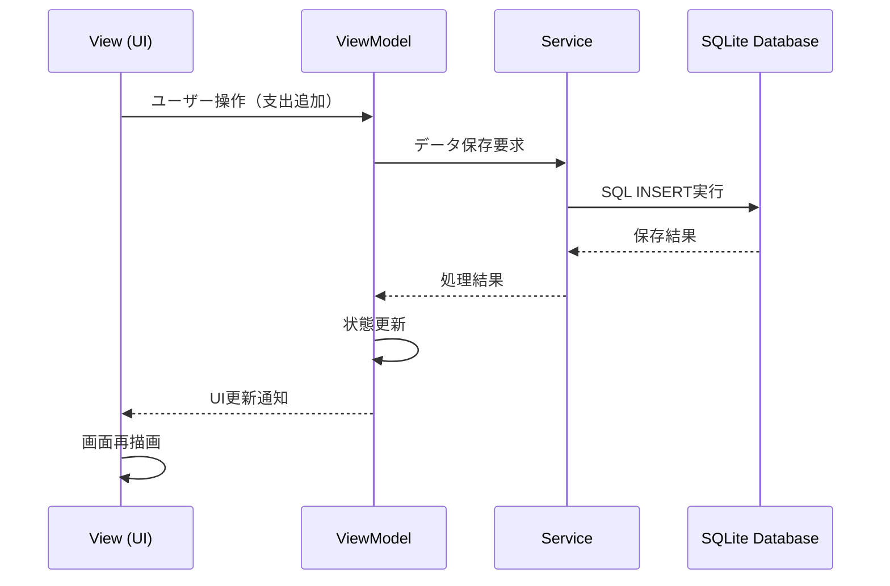
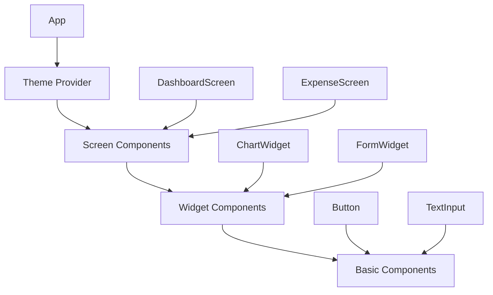
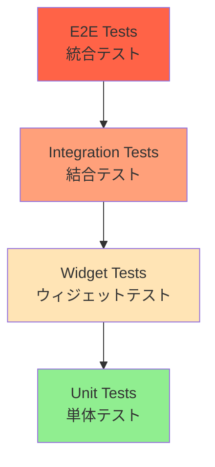

# 🏗️ MoneyG Finance App - アーキテクチャ

> **プライバシーファーストな家計管理アプリの技術設計**  

---

## 🎯 アーキテクチャ概要

MoneyG Finance Appは、**プライバシー保護**と**クロスプラットフォーム対応**を重視したアーキテクチャ設計を採用しています。Flutter + Dart技術スタックにより、Android・iOS・デスクトップ環境での一貫したユーザー体験を提供します。

### 🎨 設計原則

- 🔒 **プライバシーファースト**: 完全ローカルデータ保存
- 📱 **クロスプラットフォーム**: 単一コードベースでマルチプラットフォーム対応
- 🧩 **モジュラー設計**: 疎結合で保守性の高いアーキテクチャ
- ⚡ **パフォーマンス最適化**: レスポンシブで高速な操作体験
- 🧪 **テスタブルコード**: 単体テスト・統合テストを考慮した設計

---

## 🏛️ アーキテクチャパターン

### 📊 MVVM (Model-View-ViewModel) パターン

MoneyG Finance Appは、**MVVMアーキテクチャパターン**を採用し、関心の分離と保守性を実現しています。



#### 🎭 各層の責任

| 層 | 責任 | 実装例 |
|---|-----|--------|
| **View** | UI表示・ユーザー操作 | `ExpenseScreen`, `DashboardScreen` |
| **ViewModel** | 状態管理・ビジネスロジック仲介 | `ExpenseViewModel`, `IncomeViewModel` |
| **Model** | データ構造定義 | `Expense`, `Income`, `NisaInvestment` |
| **Service** | ビジネスロジック・外部サービス連携 | `DatabaseService`, `ExportService` |
| **Data** | データ永続化・取得 | SQLite Database |

---

## 📁 プロジェクト構造

### 🗂️ ディレクトリ構成

```
lib/
├── main.dart                          # アプリケーションエントリーポイント
├── models/                            # データモデル層
│   ├── expense.dart                   # 支出データモデル
│   ├── income.dart                    # 収入データモデル
│   └── nisa_investment.dart           # NISA投資データモデル
├── services/                          # サービス層（ビジネスロジック）
│   ├── database_service.dart          # データベース操作サービス
│   ├── budget_service.dart            # 予算管理サービス
│   ├── csv_import_service.dart        # CSVインポートサービス
│   ├── export_service.dart            # データエクスポートサービス
│   └── notification_service.dart      # 通知サービス
├── viewmodels/                        # ViewModel層（状態管理）
│   ├── expense_viewmodel.dart         # 支出画面の状態管理
│   ├── income_viewmodel.dart          # 収入画面の状態管理
│   ├── nisa_viewmodel.dart            # NISA投資画面の状態管理
│   ├── asset_analysis_viewmodel.dart  # 資産分析画面の状態管理
│   └── theme_viewmodel.dart           # テーマ設定の状態管理
├── views/                             # View層（画面・UI）
│   ├── splash_screen.dart             # スプラッシュ画面
│   ├── dashboard_screen.dart          # ダッシュボード画面
│   ├── expense/                       # 支出関連画面
│   ├── income/                        # 収入関連画面
│   └── settings/                      # 設定関連画面
├── widgets/                           # 再利用可能UIコンポーネント
│   ├── common/                        # 共通ウィジェット
│   ├── charts/                        # グラフコンポーネント
│   └── forms/                         # フォームコンポーネント
└── utils/                             # ユーティリティ・共通機能
    ├── app_theme.dart                 # アプリテーマ定義
    └── test_data_helper.dart          # テストデータヘルパー
```

### 📋 命名規則

#### ファイル・クラス命名
- **画面ファイル**: `snake_case_screen.dart` (例: `expense_list_screen.dart`)
- **ViewModelファイル**: `snake_case_viewmodel.dart` (例: `expense_viewmodel.dart`)
- **サービスファイル**: `snake_case_service.dart` (例: `database_service.dart`)
- **クラス名**: `PascalCase` (例: `ExpenseViewModel`)

#### 変数・メソッド命名
- **変数名**: `camelCase` (例: `totalExpense`)
- **定数**: `SCREAMING_SNAKE_CASE` (例: `MAX_BUDGET_AMOUNT`)
- **プライベートメンバ**: `_camelCase` (例: `_databaseInstance`)

---

## 🔧 技術スタック

### 🚀 コア技術

| 技術 | バージョン | 用途 | 特徴 |
|------|-----------|------|------|
| **Flutter** | 3.32.2+ | UIフレームワーク | クロスプラットフォーム開発 |
| **Dart** | 3.8.1+ | プログラミング言語 | 型安全・高パフォーマンス |
| **SQLite** | 2.3.2+ | ローカルデータベース | オフライン動作・プライバシー保護 |

### 📦 主要依存関係

#### 状態管理・アーキテクチャ
```yaml
provider: ^6.1.2              # 状態管理（MVVM実現）
```

#### データベース・永続化
```yaml
sqflite: ^2.3.2               # SQLiteデータベース（Android/iOS）
sqflite_common_ffi: ^2.3.2    # SQLiteデータベース（Desktop）
path_provider: ^2.1.2         # ファイルパス取得
shared_preferences: ^2.2.2    # 軽量設定保存
```

#### UI・UX
```yaml
fl_chart: ^1.0.0              # チャート・グラフ表示
google_fonts: ^6.2.0          # フォント管理
modal_bottom_sheet: ^3.0.0    # モーダルUI
cupertino_icons: ^1.0.8       # iOS風アイコン
```

#### ユーティリティ
```yaml
intl: ^0.20.2                 # 国際化・日付フォーマット
csv: ^6.0.0                   # CSVファイル処理
```

---

## 💾 データアーキテクチャ

### 🗄️ データベース設計

#### SQLite スキーマ構成

```sql
-- 支出テーブル
CREATE TABLE expenses (
    id INTEGER PRIMARY KEY AUTOINCREMENT,
    title TEXT NOT NULL,                -- 支出タイトル
    amount REAL NOT NULL,               -- 金額
    category TEXT NOT NULL,             -- カテゴリ
    date TEXT NOT NULL,                 -- 日付（ISO 8601形式）
    description TEXT,                   -- 詳細説明
    created_at TEXT NOT NULL,           -- 作成日時
    updated_at TEXT NOT NULL            -- 更新日時
);

-- 収入テーブル
CREATE TABLE incomes (
    id INTEGER PRIMARY KEY AUTOINCREMENT,
    title TEXT NOT NULL,                -- 収入タイトル
    amount REAL NOT NULL,               -- 金額
    category TEXT NOT NULL,             -- カテゴリ
    date TEXT NOT NULL,                 -- 日付（ISO 8601形式）
    description TEXT,                   -- 詳細説明
    created_at TEXT NOT NULL,           -- 作成日時
    updated_at TEXT NOT NULL            -- 更新日時
);

-- NISA投資テーブル
CREATE TABLE nisa_investments (
    id INTEGER PRIMARY KEY AUTOINCREMENT,
    investment_name TEXT NOT NULL,      -- 投資商品名
    amount REAL NOT NULL,               -- 投資金額
    investment_date TEXT NOT NULL,      -- 投資日（ISO 8601形式）
    investment_type TEXT NOT NULL,      -- 投資タイプ（一般NISA/つみたてNISA）
    description TEXT,                   -- 詳細説明
    created_at TEXT NOT NULL,           -- 作成日時
    updated_at TEXT NOT NULL            -- 更新日時
);

-- カテゴリマスターテーブル（v1.3.0で追加予定）
CREATE TABLE categories (
    id INTEGER PRIMARY KEY AUTOINCREMENT,
    name TEXT NOT NULL UNIQUE,          -- カテゴリ名
    type TEXT NOT NULL,                 -- タイプ（expense/income）
    color TEXT,                         -- 表示色
    icon TEXT,                          -- アイコンコード
    is_default BOOLEAN DEFAULT FALSE,   -- デフォルトカテゴリフラグ
    display_order INTEGER DEFAULT 0,    -- 表示順序
    created_at TEXT NOT NULL,           -- 作成日時
    updated_at TEXT NOT NULL            -- 更新日時
);
```

#### インデックス戦略
```sql
-- パフォーマンス最適化のためのインデックス
CREATE INDEX idx_expenses_date ON expenses(date);
CREATE INDEX idx_expenses_category ON expenses(category);
CREATE INDEX idx_incomes_date ON incomes(date);
CREATE INDEX idx_incomes_category ON incomes(category);
CREATE INDEX idx_nisa_date ON nisa_investments(investment_date);
```

### 🔄 データフロー



---

## 🎨 UI/UXアーキテクチャ

### 🎯 デザインシステム

#### Material Design 3.0 準拠
- **カラーシステム**: Dynamic Color対応
- **タイポグラフィ**: Google Fonts使用
- **レイアウト**: レスポンシブグリッドシステム
- **アニメーション**: Flutter標準アニメーション

#### コンポーネント階層


### 📱 レスポンシブデザイン

#### ブレークポイント戦略
```dart
class ScreenBreakpoints {
  static const double mobile = 600;      // スマートフォン
  static const double tablet = 1024;     // タブレット
  static const double desktop = 1440;    // デスクトップ
}
```

#### 適応型レイアウト
- **スマートフォン**: 縦スクロール・シングルカラム
- **タブレット**: 2カラムレイアウト・サイドナビゲーション
- **デスクトップ**: マルチペイン・リッチ情報表示

---

## 🔒 セキュリティアーキテクチャ

### 🛡️ プライバシー保護設計

#### データ保護原則
1. **ローカルファースト**: すべてのデータはデバイス内保存
2. **暗号化**: 機密データの暗号化保存
3. **権限最小化**: 必要最小限のシステム権限
4. **セキュアコーディング**: 脆弱性対策の実装

#### 実装例
```dart
class SecureDataStorage {
  // 機密データの暗号化保存
  static Future<void> saveSecureData(String key, String value) async {
    final encrypted = _encrypt(value);
    await _storage.setString(key, encrypted);
  }
  
  // セキュアな文字列暗号化
  static String _encrypt(String plainText) {
    // AES暗号化実装
    return encryptedText;
  }
}
```

### 🔐 データアクセス制御

#### アクセス層の分離
```dart
abstract class DataRepository {
  Future<List<T>> getAll<T>();
  Future<T?> getById<T>(int id);
  Future<void> save<T>(T entity);
  Future<void> delete<T>(int id);
}

class SecureRepository implements DataRepository {
  // セキュリティチェック付きデータアクセス
  @override
  Future<List<T>> getAll<T>() async {
    _validateAccess();
    return await _database.getAll<T>();
  }
}
```

---

## ⚡ パフォーマンス設計

### 🚀 最適化戦略

#### メモリ管理
- **効率的なWidgetツリー**: const constructor活用
- **リソース管理**: 適切なdispose処理
- **遅延ロード**: 大量データの段階的読み込み

#### レンダリング最適化
```dart
class OptimizedExpenseList extends StatelessWidget {
  @override
  Widget build(BuildContext context) {
    return ListView.builder(
      // 仮想化による効率的なリスト表示
      itemBuilder: (context, index) => ExpenseItem(
        key: ValueKey(expenses[index].id), // 効率的な再描画
        expense: expenses[index],
      ),
      itemCount: expenses.length,
    );
  }
}
```

#### データベースパフォーマンス
- **接続プール**: 単一データベース接続の再利用
- **インデックス活用**: クエリ最適化
- **バッチ処理**: 大量データ操作の効率化

### 📊 パフォーマンス目標

| 指標 | 目標値 | 現在値 | 測定方法 |
|------|--------|--------|----------|
| **アプリ起動時間** | <1.5秒 | <2秒 | スプラッシュ→メイン画面 |
| **画面遷移時間** | <300ms | <500ms | ページナビゲーション |
| **データベースクエリ** | <100ms | <200ms | 一般的なSELECT文 |
| **メモリ使用量** | <40MB | <50MB | アイドル時のRAM使用量 |

---

## 🧪 テストアーキテクチャ

### 🎯 テスト戦略

#### テストピラミッド


#### テスト種別

| テスト種別 | 対象 | カバレッジ目標 | 実装例 |
|-----------|------|---------------|--------|
| **Unit Tests** | ビジネスロジック・ユーティリティ | 90%+ | Modelクラステスト |
| **Widget Tests** | UIコンポーネント | 80%+ | 画面コンポーネントテスト |
| **Integration Tests** | データフロー・画面遷移 | 70%+ | ユーザーシナリオテスト |
| **E2E Tests** | 全体ワークフロー | 主要機能 | アプリ全体のワークフロー |

#### テスト実装例
```dart
// Unit Test例
void main() {
  group('ExpenseService Tests', () {
    test('should calculate total expense correctly', () {
      // Arrange
      final expenses = [
        Expense(amount: 1000, category: 'Food'),
        Expense(amount: 2000, category: 'Transport'),
      ];
      
      // Act
      final total = ExpenseService.calculateTotal(expenses);
      
      // Assert
      expect(total, equals(3000));
    });
  });
}
```

---

## 🔄 CI/CD アーキテクチャ

### 🚀 継続的インテグレーション

#### GitHub Actions ワークフロー
```yaml
name: CI/CD Pipeline
on: [push, pull_request]

jobs:
  test:
    runs-on: ubuntu-latest
    steps:
      - uses: actions/checkout@v3
      - uses: subosito/flutter-action@v2
      - run: flutter pub get
      - run: flutter analyze
      - run: flutter test
      - run: flutter build apk
```

#### 品質ゲート
- ✅ **静的解析**: `flutter analyze`でのコード品質チェック
- ✅ **テスト実行**: 全テストパス
- ✅ **ビルド確認**: Android・iOS・デスクトップビルド成功
- ✅ **カバレッジ**: テストカバレッジ85%以上

---

## 🌐 国際化アーキテクチャ

### 🗣️ 多言語対応設計

#### 国際化実装
```dart
// l10n/app_localizations.dart
class AppLocalizations {
  static const List<Locale> supportedLocales = [
    Locale('ja', 'JP'), // 日本語
    Locale('en', 'US'), // 英語（予定）
    Locale('ko', 'KR'), // 韓国語（予定）
    Locale('zh', 'CN'), // 中国語（予定）
  ];
}
```

#### 文字列管理
- **ARBファイル**: 翻訳可能な文字列の管理
- **文脈対応**: プルラル形式・性別対応
- **動的読み込み**: 言語切り替えの即座反映

---

## 📈 スケーラビリティ設計

### 🔧 拡張性考慮

#### プラグインアーキテクチャ
```dart
abstract class FeaturePlugin {
  String get name;
  void initialize();
  Widget buildUI();
}

class PluginManager {
  static final List<FeaturePlugin> _plugins = [];
  
  static void registerPlugin(FeaturePlugin plugin) {
    _plugins.add(plugin);
    plugin.initialize();
  }
}
```

#### モジュール分割
- **コア機能**: 基本的な家計管理機能
- **拡張機能**: 高度な分析・レポート機能
- **統合機能**: 外部サービス連携（将来）

### 🚀 将来展望

#### v2.0.0 アーキテクチャ進化
- **Web対応**: Flutter Webによるブラウザ版
- **API層追加**: バックエンドサービス連携準備
- **マイクロフロントエンド**: 機能別モジュール分離
- **パフォーマンス**: WebAssembly活用検討

---

## 📚 技術リファレンス

### 🔗 外部リソース

- **[Flutter Architecture Guide](https://flutter.dev/docs/development/architecture)**
- **[Dart Language Tour](https://dart.dev/guides/language/language-tour)**
- **[SQLite Documentation](https://www.sqlite.org/docs.html)**
- **[Material Design 3](https://m3.material.io/)**

### 📖 プロジェクト関連ドキュメント

- **[コーディング規約](Coding-Standards.md)**: 開発ルール・スタイルガイド
- **[テストガイド](Testing-Guide.md)**: テスト実装・戦略ガイド
- **[API リファレンス](API-Reference.md)**: 内部API仕様書
- **[開発環境セットアップ](Development-Setup.md)**: 環境構築手順

---

**📝 最終更新**: 2025年6月20日  
**📄 ドキュメントバージョン**: v1.0  
**👥 作成者**: [@paraccoli](https://github.com/paraccoli)