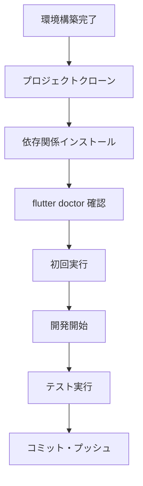

# 🛠️ MoneyG Finance App - 開発環境セットアップ

> MoneyG Finance Appの開発環境構築完全ガイド

---

## 🎯 セットアップ概要

このガイドでは、MoneyG Finance Appの開発に必要な環境を**ゼロから構築**する手順を詳しく説明します。Windows、macOS、Linuxの各プラットフォームに対応し、初心者でも安心して開発を始められるよう設計されています。

### 📋 要件概要

| 項目 | 要件 | 備考 |
|------|------|------|
| **Flutter SDK** | 3.32.2+ | 必須（最新安定版推奨） |
| **Dart SDK** | 3.8.1+ | Flutter内包 |
| **OS** | Windows/macOS/Linux | クロスプラットフォーム対応 |
| **IDE** | VS Code / Android Studio | VS Code推奨 |
| **Android SDK** | API Level 21+ | Android開発用 |
| **Xcode** | 14.0+ | iOS開発用（macOSのみ） |
| **Git** | 2.0+ | ソースコード管理 |

---

## 💻 システム要件

### 🖥️ Windows 10/11

#### 最小要件
- **OS**: Windows 10 64-bit (version 1903以降)
- **RAM**: 8GB以上 （16GB推奨）
- **ストレージ**: 20GB以上の空き容量
- **CPU**: Intel i5 / AMD Ryzen 5 相当以上

#### 推奨要件
- **OS**: Windows 11 64-bit
- **RAM**: 16GB以上
- **ストレージ**: SSD 50GB以上
- **CPU**: Intel i7 / AMD Ryzen 7 以上
- **GPU**: 統合グラフィックス以上

### 🍎 macOS

#### 最小要件
- **OS**: macOS 10.15 (Catalina) 以降
- **RAM**: 8GB以上 （16GB推奨）
- **ストレージ**: 30GB以上の空き容量
- **CPU**: Intel Core i5 / Apple M1 以上

#### 推奨要件
- **OS**: macOS 12.0 (Monterey) 以降
- **RAM**: 16GB以上
- **ストレージ**: SSD 100GB以上
- **CPU**: Intel Core i7 / Apple M1 Pro以上

### 🐧 Linux (Ubuntu/Debian)

#### 最小要件
- **OS**: Ubuntu 18.04 LTS / Debian 10 以降
- **RAM**: 8GB以上
- **ストレージ**: 20GB以上の空き容量
- **CPU**: Intel i5 / AMD Ryzen 5 相当以上

---

## 🔧 基本ツールのインストール

### 1. 📦 Git のインストール

#### Windows
```powershell
# Chocolateyを使用（推奨）
choco install git

# または公式サイトからダウンロード
# https://git-scm.com/download/win
```

#### macOS
```bash
# Homebrewを使用（推奨）
brew install git

# または Xcodeコマンドラインツール
xcode-select --install
```

#### Linux (Ubuntu/Debian)
```bash
sudo apt update
sudo apt install git
```

#### 設定確認
```bash
git --version
git config --global user.name "Your Name"
git config --global user.email "your.email@example.com"
```

---

## 🎯 Flutter SDK セットアップ

### 1. 📥 Flutter SDK ダウンロード

#### 方法A: 公式サイトからダウンロード（推奨）

1. **[Flutter公式サイト](https://flutter.dev/docs/get-started/install)** にアクセス
2. お使いのOSを選択
3. **Flutter SDK**をダウンロード
4. 適切なディレクトリに展開

#### Windows展開例
```powershell
# C:\flutter に展開（推奨）
Expand-Archive -Path flutter_windows_3.32.2-stable.zip -DestinationPath C:\
```

#### macOS/Linux展開例
```bash
# /usr/local/flutter に展開（推奨）
sudo unzip flutter_macos_3.32.2-stable.zip -d /usr/local/
```

### 2. 🛤️ PATH環境変数の設定

#### Windows (PowerShell)
```powershell
# 環境変数に追加
[Environment]::SetEnvironmentVariable("Path", $env:Path + ";C:\flutter\bin", "User")

# 確認
flutter --version
```

#### macOS/Linux (bash/zsh)
```bash
# ~/.bashrc または ~/.zshrc に追加
echo 'export PATH="$PATH:/usr/local/flutter/bin"' >> ~/.bashrc
source ~/.bashrc

# 確認
flutter --version
```

### 3. 🔍 Flutter Doctor実行

```bash
flutter doctor
```

**期待される出力例:**
```
Doctor summary (to see all details, run flutter doctor -v):
[✓] Flutter (Channel stable, 3.32.2, on macOS 12.6)
[✓] Android toolchain - develop for Android devices
[✓] Xcode - develop for iOS and macOS
[✓] Chrome - develop for the web
[✓] Android Studio
[✓] VS Code
[✓] Connected device (1 available)
[✓] Network resources

• No issues found!
```

---

## 📱 Android 開発環境

### 1. 🔧 Android Studio インストール

#### ダウンロード・インストール
1. **[Android Studio公式サイト](https://developer.android.com/studio)** からダウンロード
2. インストーラーを実行
3. **Standard Installation**を選択
4. 必要なコンポーネントをダウンロード

#### 必要なコンポーネント
- Android SDK Platform Tools
- Android SDK Build Tools
- Android Emulator
- Android SDK Platform (API 34推奨)

### 2. 📦 Android SDK設定

#### SDK Manager での設定
1. Android Studio を起動
2. **Tools** → **SDK Manager**
3. 以下を確認・インストール:

| 項目 | バージョン | 説明 |
|------|-----------|------|
| **Android SDK Platform** | API 34 (Android 14) | 最新API |
| **Android SDK Platform** | API 21 (Android 5.0) | 最小サポート |
| **Android SDK Build-Tools** | 34.0.0 | ビルドツール |
| **Android Emulator** | 最新 | エミュレーター |
| **Android SDK Platform-Tools** | 最新 | 開発ツール |

### 3. 🔧 環境変数設定

#### Windows
```powershell
# ANDROID_HOME 設定
[Environment]::SetEnvironmentVariable("ANDROID_HOME", "$env:LOCALAPPDATA\Android\Sdk", "User")

# PATH に追加
$androidTools = "$env:LOCALAPPDATA\Android\Sdk\platform-tools;$env:LOCALAPPDATA\Android\Sdk\tools\bin"
[Environment]::SetEnvironmentVariable("Path", $env:Path + ";$androidTools", "User")
```

#### macOS/Linux
```bash
# ~/.bashrc または ~/.zshrc に追加
export ANDROID_HOME=$HOME/Library/Android/sdk  # macOS
# export ANDROID_HOME=$HOME/Android/Sdk      # Linux

export PATH=$PATH:$ANDROID_HOME/platform-tools:$ANDROID_HOME/tools/bin
```

### 4. 📱 Android Emulator 作成

#### AVD Manager での作成
1. Android Studio で **Tools** → **AVD Manager**
2. **Create Virtual Device**
3. 推奨設定:

| 設定項目 | 推奨値 | 理由 |
|---------|--------|------|
| **Device** | Pixel 7 | 標準的なサイズ |
| **System Image** | Android 14 (API 34) | 最新安定版 |
| **RAM** | 4GB以上 | 安定動作 |
| **Storage** | 8GB以上 | アプリ容量確保 |

---

## 🍎 iOS 開発環境（macOSのみ）

### 1. 🔧 Xcode インストール

#### App Store からインストール
```bash
# App Store から Xcode をインストール
# または、Apple Developer サイトからダウンロード
```

#### コマンドラインツール設定
```bash
# Xcode コマンドラインツールをインストール
xcode-select --install

# ライセンス同意
sudo xcodebuild -license accept
```

### 2. 📱 iOS Simulator 確認

```bash
# 利用可能なシミュレーターを確認
xcrun simctl list devices

# シミュレーター起動例
open -a Simulator
```

### 3. 🔧 CocoaPods インストール

```bash
# CocoaPods インストール
sudo gem install cocoapods

# 確認
pod --version
```

---

## 💻 IDE セットアップ

### 🎯 Visual Studio Code（推奨）

#### 1. インストール
1. **[VS Code公式サイト](https://code.visualstudio.com/)** からダウンロード
2. インストーラーを実行

#### 2. 必須拡張機能

```bash
# Flutter拡張機能をインストール（コマンドパレットから）
# 以下の拡張機能がインストールされます：
```

| 拡張機能 | 機能 | 必須度 |
|----------|------|--------|
| **Flutter** | Flutter開発サポート | ⭐⭐⭐ |
| **Dart** | Dart言語サポート | ⭐⭐⭐ |
| **Flutter Widget Snippets** | ウィジェットスニペット | ⭐⭐ |
| **Awesome Flutter Snippets** | 便利なスニペット | ⭐⭐ |
| **Flutter Tree** | ウィジェットツリー表示 | ⭐ |

#### 3. 推奨設定

**settings.json** 設定例:
```json
{
  "flutter.sdk": "C:\\flutter",
  "dart.flutterSdkPath": "C:\\flutter",
  "editor.formatOnSave": true,
  "dart.lineLength": 80,
  "flutter.hotReload": true,
  "dart.analysisServerPath": "",
  "dart.debugExternalLibraries": false,
  "dart.previewLsp": true
}
```

### 🔧 Android Studio

#### Flutter Plugin インストール
1. **File** → **Settings** (Windows/Linux) / **Preferences** (macOS)
2. **Plugins** を選択
3. **Flutter** プラグインを検索・インストール
4. **Dart** プラグインも自動インストールされます

---

## 📁 プロジェクト取得・セットアップ

### 1. 🔄 リポジトリクローン

```bash
# GitHubからクローン
git clone https://github.com/paraccoli/flutter_finance_app.git
cd flutter_finance_app
```

### 2. 📦 依存関係インストール

```bash
# 依存関係を取得
flutter pub get

# 依存関係の確認
flutter pub deps
```

### 3. 🔍 プロジェクト検証

```bash
# Flutter Doctor でプロジェクト固有の問題をチェック
flutter doctor

# プロジェクトの静的解析
flutter analyze

# テスト実行
flutter test
```

### 4. 🏃‍♂️ 初回実行

```bash
# デバッグモードで実行
flutter run

# 特定デバイスで実行
flutter devices
flutter run -d <device-id>
```

---

## 🔧 開発環境の最適化

### ⚡ パフォーマンス設定

#### VS Code 最適化設定
```json
{
  "dart.analysisServerPath": "",
  "dart.enableSdkFormatter": true,
  "dart.lineLength": 120,
  "dart.completeFunctionCalls": true,
  "dart.closingLabels": true,
  "flutter.hot Reload": true,
  "flutter.experimental.hotReload": true
}
```

#### Android Studio 最適化
1. **File** → **Settings** → **Build, Execution, Deployment**
2. **Compiler** で **Build process heap size** を 4096MB に設定
3. **Runtime** で **IDE heap size** を 2048MB に設定

### 🔍 デバッグ設定

#### launch.json 設定例
```json
{
  "version": "0.2.0",
  "configurations": [
    {
      "name": "Debug",
      "request": "launch",
      "type": "dart",
      "program": "lib/main.dart"
    },
    {
      "name": "Profile",
      "request": "launch",
      "type": "dart",
      "flutterMode": "profile",
      "program": "lib/main.dart"
    }
  ]
}
```

---

## 📊 開発ツール・プラグイン

### 🔧 便利なツール

#### コマンドラインツール
```bash
# Flutter Inspector（デバッグ時に使用）
flutter inspector

# Widget Inspector をWebで表示
flutter run --web-port=8080

# ログ監視
flutter logs

# アプリサイズ分析
flutter build apk --analyze-size
```

#### パッケージ管理
```bash
# 依存関係の更新
flutter pub upgrade

# 依存関係の詳細表示
flutter pub deps --style=tree

# 未使用パッケージの確認
flutter pub deps --style=list
```

### 🎨 コード品質ツール

#### 静的解析設定
**analysis_options.yaml** （プロジェクトルート）:
```yaml
include: package:flutter_lints/flutter.yaml

analyzer:
  exclude:
    - "**/*.g.dart"
    - "**/*.freezed.dart"
  
linter:
  rules:
    - prefer_const_constructors
    - prefer_const_literals_to_create_immutables
    - avoid_unnecessary_containers
    - use_build_context_synchronously
```

#### フォーマッター設定
```bash
# コードフォーマット
dart format .

# import 文の整理
dart fix --apply
```

---

## 🧪 テスト環境セットアップ

### 📋 テスト種別

| テスト種別 | 実行コマンド | 説明 |
|-----------|-------------|------|
| **Unit Tests** | `flutter test` | ビジネスロジックテスト |
| **Widget Tests** | `flutter test test/widget_test.dart` | UIコンポーネントテスト |
| **Integration Tests** | `flutter drive --target=test_driver/app.dart` | E2Eテスト |

### 🔧 テスト実行環境

#### 依存関係
```yaml
dev_dependencies:
  flutter_test:
    sdk: flutter
  flutter_lints: ^3.0.0
  mockito: ^5.4.0
  flutter_driver:
    sdk: flutter
  test: ^1.24.0
```

#### 実行例
```bash
# 全テスト実行
flutter test

# カバレッジ付きテスト
flutter test --coverage

# 特定テストファイル実行
flutter test test/models/expense_test.dart
```

---

## 🚀 ビルド・デプロイ環境

### 📱 Android ビルド

#### デバッグビルド
```bash
# APKビルド
flutter build apk --debug

# AABビルド（Google Play用）
flutter build appbundle --debug
```

#### リリースビルド
```bash
# キーストア生成（初回のみ）
keytool -genkey -v -keystore ~/key.jks -keyalg RSA -keysize 2048 -validity 10000 -alias key

# APKビルド
flutter build apk --release

# AABビルド
flutter build appbundle --release
```

### 🍎 iOS ビルド

#### デバッグビルド
```bash
# iOSアプリビルド
flutter build ios --debug
```

#### リリースビルド
```bash
# リリースビルド
flutter build ios --release

# アーカイブ作成（Xcode使用）
# Xcode で Product → Archive
```

---

## 🔍 トラブルシューティング

### ⚠️ よくある問題と解決方法

#### 1. Flutter Doctor エラー

**問題**: `Android toolchain` エラー
```bash
[✗] Android toolchain - develop for Android devices
```

**解決方法**:
```bash
# Android SDK ライセンス受諾
flutter doctor --android-licenses

# 環境変数確認
echo $ANDROID_HOME
```

#### 2. iOS 開発エラー

**問題**: `CocoaPods not installed`
```bash
[✗] iOS toolchain - develop for iOS devices
```

**解決方法**:
```bash
# CocoaPods インストール
sudo gem install cocoapods

# プロジェクトで実行
cd ios
pod install
```

#### 3. エミュレーター起動エラー

**問題**: Android Emulator が起動しない

**解決方法**:
```bash
# AVD確認
flutter emulators

# HAXM インストール確認（Intel CPU）
# BIOS設定で仮想化有効化

# AVD再作成
```

#### 4. VS Code 拡張機能エラー

**問題**: Flutter/Dart 拡張機能が動作しない

**解決方法**:
1. VS Code 再起動
2. 拡張機能再インストール
3. Flutter SDK パスの確認
4. Dart SDK 確認

### 🆘 サポートリソース

| リソース | URL | 用途 |
|---------|-----|------|
| **Flutter公式ドキュメント** | https://flutter.dev/docs | 基本情報 |
| **Flutter GitHub** | https://github.com/flutter/flutter | バグ報告 |
| **Stack Overflow** | https://stackoverflow.com/questions/tagged/flutter | Q&A |
| **Flutter Community** | https://discord.gg/flutter | コミュニティ |

---

## 📚 次のステップ

### 🎯 開発開始

環境構築が完了したら、以下のドキュメントを参照してください：

1. **[アーキテクチャ](Architecture.md)**: システム設計の理解
2. **[API リファレンス](API-Reference.md)**: 内部API仕様
3. **[コーディング規約](Coding-Standards.md)**: 開発ルール
4. **[テストガイド](Testing-Guide.md)**: テスト実装方法
5. **[コントリビューションガイド](../CONTRIBUTING.md)**: 貢献方法

### 🔧 推奨開発フロー



### 📋 開発チェックリスト

- [ ] Flutter SDK (3.32.2+) インストール完了
- [ ] Android開発環境セットアップ完了
- [ ] iOS開発環境セットアップ完了（macOSのみ）
- [ ] IDE（VS Code）セットアップ完了
- [ ] プロジェクトクローン・実行成功
- [ ] `flutter doctor` でエラーなし
- [ ] `flutter analyze` でエラーなし
- [ ] `flutter test` でテスト成功
- [ ] アーキテクチャドキュメント確認済み
- [ ] コーディング規約確認済み

---

**📝 最終更新**: 2025年6月20日  
**📄 ドキュメントバージョン**: v1.0  
**👥 作成者**: [@paraccoli](https://github.com/paraccoli)

---

*📌 **注意**: 環境構築で問題が発生した場合は、[GitHub Issues](https://github.com/paraccoli/flutter_finance_app/issues)でサポートを求めてください。*
